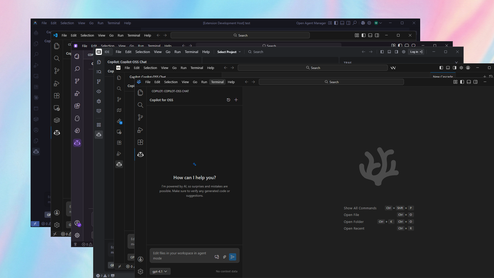

# Copilot for VS Code OSS



<div align="center">

[](LICENSE)
[](package.json)

**A simplified GitHub Copilot experience, unbundled.**

</div>

---

**Copilot for VS Code OSS** brings the power of GitHub Copilot to your favorite open-source editors. Whether you use **VS Code OSS**, **VSCodium**, **Cursor**, **Windsurf**, **Trae**, or **Google Antigravity**, this extension provides a premium, native-feeling AI chat interface powered by the official GitHub Copilot SDK.

Run the same agentic engine behind the Copilot CLI directly in your sidebar—handling planning, tool invocation, and multi-model support with ease.

## ✨ Features

- **🤖 Multi-Model Support**: Switch seamlessly between top-tier models like **GPT-4**, **Claude 3.5 Sonnet**, and others available via your Copilot subscription.
- **💬 Native Chat Experience**: A meticulously crafted UI that follows VS Code's design guidelines. It looks and feels like it belongs in your editor.
- **📎 Context-Aware**: Attach workspace files to your prompts. The agent understands your code structure and dependencies.
- **⚡ Streaming Responses**: Real-time token streaming with visual progress indicators for "thinking" and tool execution steps.
- **🛠️ Agentic Capabilities**: Powered by the **@github/copilot-sdk**, the agent can plan complex tasks, edit files, and run commands (coming soon).
- **🔒 Secure & Private**: Uses your own GitHub Copilot subscription. Your code stays between you and GitHub.

## 🚀 Tested Environments

This extension is designed to be universal. It has been tested and verified on:

- **Visual Studio Code** (Official)
- **VSCodium** (Open Source)
- **Cursor** (AI Editor)
- **Windsurf**
- **Trae**
- **Kiro**
- **Google Antigravity**

## 📋 Prerequisites

Before you begin, ensure you have the following secure environment:

1.  **Node.js 18+**: Required to run the extension backend.
2.  **GitHub Copilot Subscription**: You need an active subscription (Individual, Business, or Enterprise).
3.  **Copilot CLI**: The extension relies on the `github-copilot-cli` for authentication and model access.
    ```bash
    # Install via npm
    npm install -g @githubnext/github-copilot-cli

    # Authenticate
    github-copilot-cli auth
    ```

## 📦 Installation

### From Marketplace (Coming Soon)
Search for `Copilot for VS Code OSS` in your editor's extension marketplace.

### Manual Installation (VSIX)
1.  Download the latest `.vsix` release from the [Releases](https://github.com/yourusername/copilot-vscode-oss/releases) page.
2.  In VS Code, open the Command Palette (`Ctrl+Shift+P` / `Cmd+Shift+P`).
3.  Type `Extensions: Install from VSIX...` and select the downloaded file.

### Building from Source
```bash
# 1. Clone the repository
git clone https://github.com/yourusername/copilot-vscode-oss.git
cd copilot-vscode-oss/copilot-for-vscode-oss

# 2. Install dependencies
npm install
cd webview && npm install && cd ..

# 3. Package the extension
npm run package
# This generates a .vsix file in the directory
```

## ⚙️ Configuration

Customize your experience in VS Code Settings (`Ctrl+,`):

| Setting | Default | Description |
| :--- | :--- | :--- |
| `aiChat.defaultModel` | `gpt-4.1` | The default model to use for new sessions. |

## 🧭 Roadmap

- [ ] **Slash commands** (e.g., `/fix`, `/explain`)
- [ ] **Terminal integration** (run suggested commands directly)
- [ ] **MCP Server Support** (Model Context Protocol)

## 🤝 Contributing

We welcome contributions! Please see [CONTRIBUTING.md](CONTRIBUTING.md) for details on how to set up your development environment and submit pull requests.

## 📄 License

This project is licensed under the [AGPL-3.0 License](LICENSE).

---

<div align="center">
Made with ❤️ for the Open Source Community
</div>
